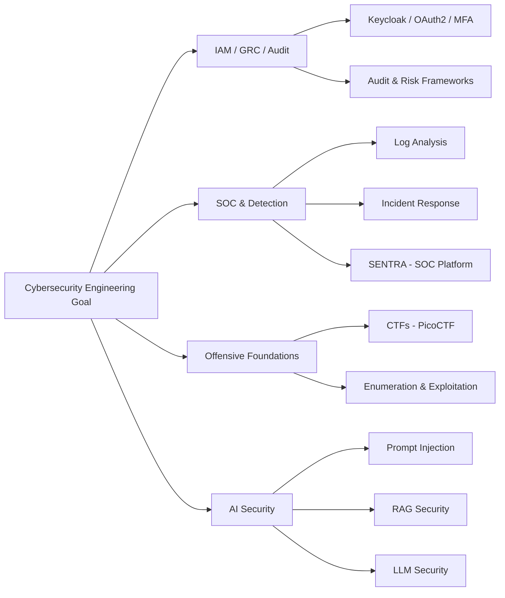

# 🛡️ KHAOULA ETTIJANI

### AI & Cybersecurity Engineering Student
### Building skills in SOC, IAM/GRC, and Offensive Security — AI as a supporting skill

---

## 👋 About Me

I'm a 4th-year **Artificial Intelligence and Cybersecurity Engineering student** at **ENSA Beni Mellal**, currently building **SENTRA**, a SOC platform project for my end-of-year internship (PFA).

I'm building foundations across:

- **Defensive security** — SOC fundamentals, log analysis, detection engineering
- **Offensive security foundations** — CTFs, enumeration, exploitation methodology
- **IAM / GRC / security administration** — my intended specialization direction

My AI/ML background supports this vision. I use it with detection modeling and AI/LLM security longer-term.

---

## 🎯 Current Focus

**SENTRA — SOC Platform (PFA Project)**
A controlled-lab SOC combining a rule-based IDS, ML-based detection (Random Forest / Isolation Forest), an ELK Stack SIEM, and NLG-based incident reporting, validated against a simulated attack environment.
Full documentation and architecture: link added once the project is completed.

---

## 🧭 Career Direction

Year 1 of my career plan is focused on generalist cybersecurity foundations with an **IAM/GRC/audit** tilt: networking, Linux/Windows administration, IAM, GRC, SOC basics, log analysis, incident response, web security, and Python for security — alongside CTF practice (PicoCTF this year, progressing to TryHackMe and HackTheBox in later years).

Longer-term direction: Year 2 — Blue Team/SOC maturity → Year 3 — Cloud security → Year 4 — Offensive security depth → Year 5 — AI security.

---

## 🛠️ Skills

*Tiered honestly — not everything below is at the same level, and I'd rather show that clearly than inflate it.*

**✅ Used in projects/labs**
`Python` · `Flask` · `Git/GitHub` · `Linux` · `Nmap` · `Wireshark` · `Burp Suite` · `ELK Stack` (via SENTRA) · `Suricata` (via SENTRA)

**🔧 Practiced in academic/lab exercises**
`OWASP Top 10 testing` · `John the Ripper` · `Hydra` · `Random Forest / Isolation Forest` · `Basic digital forensics`

**📘 Currently learning / building foundations in**
`IAM concepts (Keycloak, OAuth2, MFA)` · `GRC & audit frameworks` · `Incident response` · `Docker / DevSecOps basics`

**🔍 Exploring**
`LLM / RAG security` · `Prompt injection testing` · `Adversarial ML`

---

## 🏆 Experience & Achievements

**🚩 CTF Competitor**
- 3rd place — First OnSite CTF Competition
- MACC 2026 — ranked 182 / 1071
- Practicing on PicoCTF, with TryHackMe and HackTheBox planned for later years

**🤖 AI Engineering Intern — Training Edge Consulting**
- Fine-tuned LLaMA-2 7B for Moroccan Darija using PEFT and QLoRA
- Built data collection pipelines using Scrapy and the YouTube API
- Developed a Flask interface for model testing

**💻 Web Development Cell Lead — CSIA Club**
- Led web development activities within a cybersecurity-focused student club
- Contributed to technical initiatives and student project coordination

---

## 🎓 Education

**ENSA Beni Mellal**
State Engineer Degree — Artificial Intelligence and Cybersecurity
2021 – 2027 | Currently 4th Year

Relevant coursework: Ethical Hacking · Network Security · Cryptography · Identity and Access Management · Secure Administration · DevSecOps · Digital Forensics · Deep Learning · NLP · Computer Vision · LLM Fine-tuning

---

## 📍 Learning Roadmap

---

## 📫 Contact

Open to PFE internship opportunities in cybersecurity, SOC analysis, IAM/GRC, and security engineering.

- LinkedIn: [khaoula-ettijani-ai-cyber](https://www.linkedin.com/in/khaoula-ettijani-ai-cyber)
- Portfolio: [khaoulaettijani-iacs.github.io](https://khaoulaettijani-iacs.github.io/khaoulaettijani.github.io/)
- Email: [khaoulaettijani19@gmail.com](mailto:khaoulaettijani19@gmail.com)
