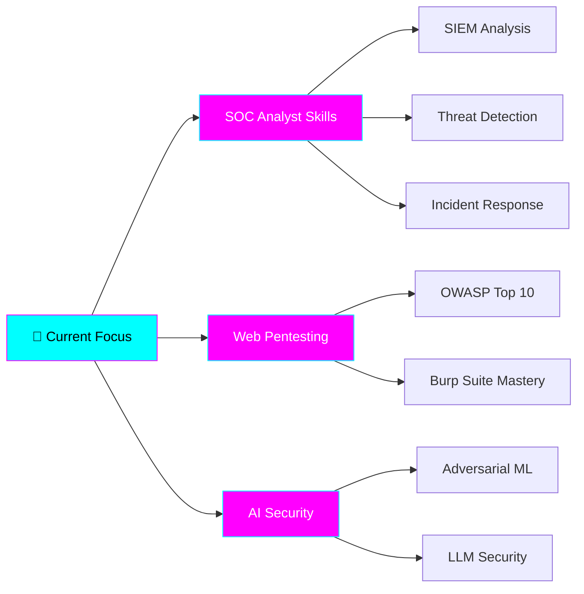

<div align="center">

# 🛡️ KHAOULA ETTIJANI
### AI and Cybersecurity Engineering Student | AI Security Researcher

[](https://www.linkedin.com/in/khaoula-ettijani-ai-cyber)
[](https://khaoulaettijani-iacs.github.io/khaoulaettijani.github.io/)
[](mailto:khaoulaettijani19@gmail.com)


</div>

---

## 👋 About Me
```python
class CybersecurityEngineer:
    def __init__(self):
        self.name = "Khaoula Ettijani"
        self.education = "4th Year AI & Cybersecurity Engineering @ ENSA Beni Mellal"
    def current_focus(self):
        return {
            "primary": "SOC Analyst Skills (Threat Detection, Incident Response)",
            "specialization": "AI Security (Adversarial ML, Model Security)",
            "learning": ["Web Pentesting", "Network Security", "Security Automation"],
            "competing": "CTF Competitions (MACC 2026)"
        }
    def seeking(self):
        return "Summer 2026 Internship (PFA) - Cybersecurity Analyst / SOC Analyst"
```

---

## 🎯 What Makes Me Different
I'm building expertise in **AI** and **Cybersecurity**.
**My unique positioning:**
- 🔐 **Security Foundation:** Pentesting, network security, ethical hacking, SOC Analysis, Forensics
- 🤖 **AI Understanding:** ML/DL, NLP, LLM fine-tuning, RAG architecture
- 🛡️ **AI Security Focus:** Securing modern AI systems against emerging threats

**Why this matters:** As AI becomes embedded everywhere, organizations need security professionals who understand both traditional infrastructure **AND** how AI models can be exploited.

---

## 🛠️ Technical Arsenal

### 🔐 Cybersecurity & Offensive Security
![Kali Linux]
![Wireshark]
![Burp Suite]
![Nmap]
![John The Ripper]
![Hydra]

**Skills:** Penetration Testing • Web App Security • Network Security • Cryptography • IAM • Ethical Hacking • AI Security • Security Administration • Forensics • GDPR

### 🤖 AI & Machine Learning
![Python]
![PyTorch]
![Hugging Face]
![Scikit-Learn]

**Skills:** Deep Learning (CNN, ANN) • NLP • LLM Fine-Tuning • RAG • Transfer Learning • Computer Vision

### 💻 Development & DevOps
![Linux]
![Git]
![Flask]
![SQL]
![Docker]
![Kubernetes]

**Skills:** Bash Scripting • Linux Admin • Version Control • Security Automation • DevSecOps

---


## 🎓 Education & Certifications

**🏫 ENSA Beni Mellal** | State Engineer's Degree in AI & Cybersecurity  
*2021 - 2027 | Currently 4th Year*

**Core Curriculum:**
- **Cybersecurity:** Ethical Hacking, Penetration Testing, Network Security, Cryptography, IAM
- **AI/ML:** Deep Learning, NLP, Computer Vision, LLM Fine-tuning
- **Current:** Secure Administration, DevSecOps, Digital Forensics, Quantum IT

---

##  Experience & Achievements

**🚩 CTF Competitor** | *2025 - Present*
- 🥉 **3rd Place** - First OnSite CTF Competition
- 🎯 **MACC 2026** Participant ranked 182 among 1071
- 🔧 Active on HackTheBox, TryHackMe, PicoCTF platforms

**🤖 AI Engineering Intern** | Training Edge Consulting | *Summer 2025*
- Fine-tuned LLaMA-2 7B for Moroccan Darija using PEFT & QLoRA
- Built data pipelines with web scraping (Scrapy, YouTube API)
- Developed Flask-based model testing interface

**💻 Web Development Cell Lead** | CSIA Club | *2024-2025*
- Led technical team for cybersecurity club initiatives
- Currently active member contributing to security projects

---

## 🌱 Current Learning Path


## 💼 Open to Opportunities
**🎯 Seeking:** Summer 2026 Internship (PFA - 3 months)

**Target Roles:**
- ✅ SOC Analyst / Cybersecurity Analyst
- ✅ Security Engineering Intern
- ✅ Threat Intelligence Analyst
- ✅ Penetration Testing Intern
- ✅ AI Security Researcher

**What I Bring:**
- Strong cybersecurity foundations (pentesting, network security, ethical hacking)
- AI/ML expertise (deep learning, NLP, LLM fine-tuning)
- Security automation with Python
- CTF competition experience
- Growth mindset and passion for learning

---

## 📫 Let's Connect!

I'm always interested in:
- 🤝 Collaborating on AI Security projects
- 💼 Cybersecurity internship opportunities
- 🎓 Security research partnerships
- 💬 Knowledge sharing about AI + Security

**Best ways to reach me:**
- 💼 [LinkedIn](https://www.linkedin.com/in/khaoula-ettijani-ai-cyber) - Professional networking
- 🌐 [Portfolio](https://khaoulaettijani-iacs.github.io/khaoulaettijani.github.io/) - See my work
- 📧 [Email](mailto:khaoulaettijani19@gmail.com) - Direct contact

---
