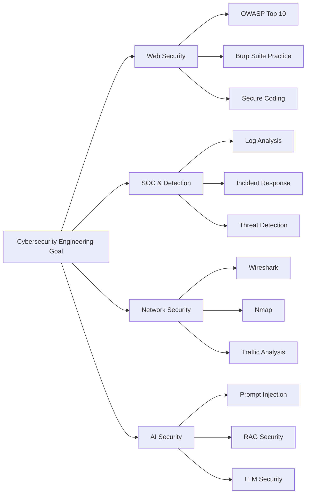

# 🛡️ KHAOULA ETTIJANI

### AI & Cybersecurity Engineering Student 

### Building skills in SOC, IAM/GRC, and offensive security, with AI as a supporting skill.

---

## 👋 About Me

I'm a 4th-year Artificial Intelligence and Cybersecurity Engineering student at ENSA Beni Mellal, currently building SENTRA, a SOC platform project for my end-of-year internship. I'm building skills across defensive security (SOC, log analysis, detection), offensive security fundamentals (CTFs, enumeration, exploitation methodology), and IAM/GRC/security administration, which is my intended specialization direction. My AI/ML background supports this vision — I use it in detection modeling and, longer-term, AI/LLM security.

---

## 🎯 Current Goal

I am currently looking for a **3-month PFA internship for Summer 2026** in one of the following areas:

* Cybersecurity / SOC Analysis
* Security Engineering
* Web Security / Penetration Testing
* Threat Detection and Incident Response
* Security Automation
* AI Security / LLM Security

---

## 🔐 Cybersecurity Focus Areas

| Area                 | Current Focus                                                     |
| -------------------- | ----------------------------------------------------------------- |
| Web Security         | OWASP Top 10, Burp Suite, vulnerability discovery, secure coding  |
| Network Security     | Nmap, Wireshark, traffic analysis, network reconnaissance         |
| SOC & Detection      | Log analysis, threat detection, incident response fundamentals    |
| Offensive Security   | CTFs, enumeration, exploitation methodology, reporting            |
| Security Engineering | automation, secure architecture, DevSecOps foundations            |
| AI Security          | prompt injection, RAG security, adversarial ML, secure AI systems |

---

## 🤖 AI as a Cybersecurity Advantage

I see AI as a complementary skill that can strengthen cybersecurity work in areas such as:

* AI-powered security automation
* Threat detection and log analysis
* Secure AI application design
* LLM Security
* Prompt Injection testing
* RAG Security
* Adversarial Machine Learning
* Model and data security

My objective is not to move away from cybersecurity, but to build a profile where AI makes me a stronger and more adaptable cybersecurity engineer.

---

## 🧪 Projects & Portfolio Status

My GitHub portfolio is currently being reviewed and reorganized to reflect a clear professional direction:

> **Cybersecurity Engineer with AI Security skills**

I am currently evaluating my existing repositories to decide which projects should be:

* improved
* rebuilt
* archived
* documented better
* showcased professionally

The final portfolio will focus on projects related to:

* Web Security
* Network Security
* SOC and Threat Detection
* Security Automation
* Offensive Security
* AI Security
* LLM and RAG Security

Each selected project will be improved with clear documentation, screenshots, diagrams, technical explanations, and security reports when relevant.

---

## 🛠️ Technical Skills

### Cybersecurity

`Linux basics` · `Burp Suite` · `Wireshark` · `Nmap` · `John the Ripper` · `Hydra` · `Linux Security` · `Suricata` · `OWASP Top 10 testing` · `ELK Stack`· `digital forensics basics`

### AI / Machine Learning

`Python` · `PyTorch` · `Scikit-learn` · `Hugging Face` · `NLP` · `LLM Fine-tuning` · `RAG` · `Computer Vision`

### Development & Engineering

`Git` · `GitHub`· `Linux` · `Bash` · `Flask` · `SQL` · `Docker` · `Security Automation` · `DevSecOps Basics`

---

## 🎓 Education

**ENSA Beni Mellal**
State Engineer Degree in Artificial Intelligence and Cybersecurity
**2021 – 2027 | Currently 4th Year**

Relevant coursework:

* Ethical Hacking
* Network Security
* Cryptography
* Identity and Access Management
* Secure Administration
* DevSecOps
* Digital Forensics
* Deep Learning
* NLP
* Computer Vision
* LLM Fine-tuning

---

## 🏆 Experience & Achievements

### 🚩 CTF Competitor

* 3rd place — First OnSite CTF Competition
* MACC 2026 participant — ranked 182 / 1071
* Practicing on HackTheBox, TryHackMe, and PicoCTF

### 🤖 AI Engineering Intern — Training Edge Consulting

* Fine-tuned LLaMA-2 7B for Moroccan Darija using PEFT and QLoRA
* Built data collection pipelines using Scrapy and YouTube API
* Developed a Flask interface for model testing and experimentation

### 💻 Web Development Cell Lead — CSIA Club

* Led web development activities within a cybersecurity-focused student club
* Contributed to technical initiatives, team coordination, and student projects

---

## 📍 Current Learning Roadmap

---

## 📫 Contact

I am open to cybersecurity internship opportunities, AI Security collaborations, CTF discussions, and technical projects.

* LinkedIn: [khaoula-ettijani-ai-cyber](https://www.linkedin.com/in/khaoula-ettijani-ai-cyber)
* Portfolio: [khaoulaettijani-iacs.github.io](https://khaoulaettijani-iacs.github.io/khaoulaettijani.github.io/)
* Email: [khaoulaettijani19@gmail.com](mailto:khaoulaettijani19@gmail.com)

---
